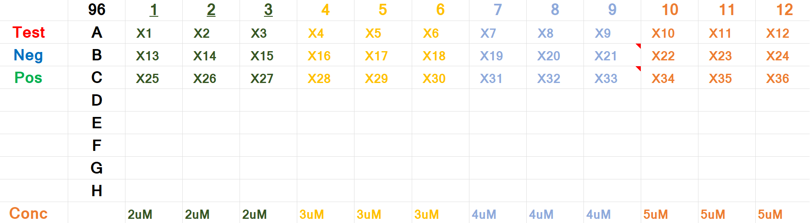

# Experimental setup-Standard

|Sample_Type (TNP)| 96 | 1 | 2 | 3 | 4 | 5 | 6 | 7 | 8 | 9 | 10 | 11 | 12 
|:---------|:---------|:-----------|:-----------|:------------|:----------|:--------|:--------|:--------|:--------|:--------|:--------|:--------|:--------
| Test | A | X1 | X2 | X3 | X4 | X5 | X6 | X7 | X8 | X9 | X10 | X11 | X12 
| Negative | B | X13 | X14 | X15 | X16 | X17 | X18 | X19 | X20 | X21 | X22 | X23 | X24 
| Positive | C | X25 | X26 | X27 | X28 | X29 | X30 | X31 | X32 | X33 | X34 | X35 | X36 
| | D |  |  |  |  |  |  |  |  |  |  |  |  
| | E |  |  |  |  |  |  |  |  |  |  |  |  
| | F |  |  |  |  |  |  |  |  |  |  |  |  
| | G |  |  |  |  |  |  |  |  |  |  |  |  
| | H |  |  |  |  |  |  |  |  |  |  |  |  
| Concentration |  | 2$\mu$M | 2$\mu$M | 2$\mu$M | 3$\mu$M | 3$\mu$M | 3$\mu$M |4$\mu$M | 4$\mu$M | 4$\mu$M | 5$\mu$M  | 5$\mu$M | 5$\mu$M 

- The above image is the standard setup for experiments using the 96 well plate. My case was specific to liposome flux assays (LFAs) but the assumption is that most experimental setups should follow the design above.

- Instances where the standard procedure is followed entails that the researcher can benefit from tracking the data in a single column after cleanup which will be illustrated.

|Sample_Type | Cycle_No | Machine_data_verbose | machine_data_numeric
|:---------|:---------|:---------|:---------
| Test | 1  | A1 | 1
| Negative | 1 | B1 | 2
| Positive | 1 | C1 | 3
| Test | 2  | A1 | 4
| Negative | 2 | B1 | 5
| Positive | 2 | C1 | 6
| Test | 40 | A1 | ...118
| Negative | 40 | B1 | ...119
| Positive | 40 | C1 | ...120

- For all three samples, the data derived from the instrument comprises of 120 tuples (rows), and this can be plotted as a single comlumn vs cycle number (1:n), were n = number of cycles, in this case 40 cycles. The machine (is dumb) and reads this sequentially so the column has 120 tuples or rows as shown above.

- The final product in the standard procedure is shown below and the package update for dat files provides a normalized version of this data as the final output.

|A1 (Test) | B1 (Negative) | C1 (Positive) | Cycle_No
|:---------|:---------|:---------|:---------
| A1 | B1 | C1 | 1
| A1 | B1 | C1 | 2
| A1 | B1 | C1 | 3
| A1 | B1 | C1 | 4
| A1 | B1 | C1 | 5
| A1 | B1 | C1 | 6
| A1 | B1 | C1 | ...38
| A1 | B1 | C1 | ...39 
| A1 | B1 | C1 | ...40

- Violation of the standard setup does not violate this algorithm but it becomes the researchers responsibility to keep track of any deviations to avoid wrong experimental results.

# Experimental setup-Non-Standard

|Sample_Type | 96 | Test | Negative | Positive | 4 | 5 | 6 | 7 | 8 | 9 | 10 | 11 | 12 
|:---------|:---------|:-----------|:------------|:------------|:----------|:--------|:--------|:--------|:--------|:--------|:--------|:--------|:--------
| | A | X1 | X2 | X3 | X4 | X5 | X6 | X7 | X8 | X9 | X10 | X11 | X12 
| | B | X13 | X14 | X15 | X16 | X17 | X18 | X19 | X20 | X21 | X22 | X23 | X24 
| | C | X25 | X26 | X27 | X28 | X29 | X30 | X31 | X32 | X33 | X34 | X35 | X36 
| | D |  |  |  |  |  |  |  |  |  |  |  |  
| | E |  |  |  |  |  |  |  |  |  |  |  |  
| | F |  |  |  |  |  |  |  |  |  |  |  |  
| | G |  |  |  |  |  |  |  |  |  |  |  |  
| | H |  |  |  |  |  |  |  |  |  |  |  |  
| Concentration |  | 2$\mu$M | 2$\mu$M | 2$\mu$M | 3$\mu$M | 3$\mu$M | 3$\mu$M |4$\mu$M | 4$\mu$M | 4$\mu$M | 5$\mu$M  | 5$\mu$M | 5$\mu$M 

- The above image is the non-standard setup for experiments using the 96 well plate. This case was specific to liposome flux assays (LFAs) but the assumption is that most experimental setups should follow the standard setup originally discussed.

- Fun fact, as a young student myself in a relatively toxic lab (better than other labs but still not healthy for the average person), I did not use the standard experimental setup in my first experiments and this entailed that the data could not eaily be analyzed. 

- This package update benefits the lab weirdo most but this is not a "Go ahead and be weird" card but rather an approach that accounts for the weakest link. The Advice is "USE THE STANDARD EXPERIMENTAL SETUP".

- The machine (is dumb) and reads this sequentially so the column has 120 tuples or rows as shown below. However, NOTICE in this case that the researcher cannot get away with just plotting a 120 tuple column because the same sample type is represented per column as seen below.

- Notice that unlike the standard case, a researcher cannot plot the 120 tuples column(s) and get final results because the data does not follow the standard experimental setup. These type of researchers benefit the most from this package. The machine scans through columns and so in the standard case, the machine accounted for all 3 sample types per plate column scanned BUT in the non-standard setup the machine accounts for a single sample type per plate column scanned.

|Sample_Type | Cycle_No | Machine_data_verbose | machine_data_numeric
|:---------|:---------|:---------|:---------
| Test-1 | 1  | A1 | 1
| Test-2 | 1 | B1 | 2
| Test-3 | 1 | C1 | 3
| Test-1 | 2  | A1 | 4
| Test-2 | 2 | B1 | 5
| Test-3 | 2 | C1 | 6
| Test-1 | 40 | A1 | ...118
| Test-2 | 40 | B1 | ...119
| Test-3 | 40 | C1 | ...120

|A1 (Test-1) | B1 (Test-2) | C1 (Test-3) | Cycle_No
|:---------|:---------|:---------|:---------
| A1 | B1 | C1 | 1
| A1 | B1 | C1 | 2
| A1 | B1 | C1 | 3
| A1 | B1 | C1 | 4
| A1 | B1 | C1 | 5
| A1 | B1 | C1 | 6
| A1 | B1 | C1 | ...38
| A1 | B1 | C1 | ...39 
| A1 | B1 | C1 | ...40

- The data provided by the package update is a normalized version of the data below. This is where researchers have more control of the data since they deviated from the standard procedure. Also 'norm_tidy_dbf' also provides the same level of control that this update for dat files provides.

- Violation of the standard setup benefits from the final product of this package although several functions will be provided to deal with the data at the level of control needed by the researcher and how savvy they are with these types of experiments. 

## Functions

- remove_na_seqdat() OR clean_evendat()
- remove_na_nonseqdat() OR clean_odddat()

## resamplefluodat
- This function originally called resample_dat_scale takes tnp = 'test,negative,positive' (number of sample types) and cycles (the number cycles the experimenter chose in the FluoStar Instrument). This means the experimenter must be self-aware enough to know the number of sample types and the number of cycles taken. Again, ensure to follow the standard setup wheneever possible and this means newcomers to the lab should be explicitly trained and taught the best-practice or standard procedure for loading samples.

